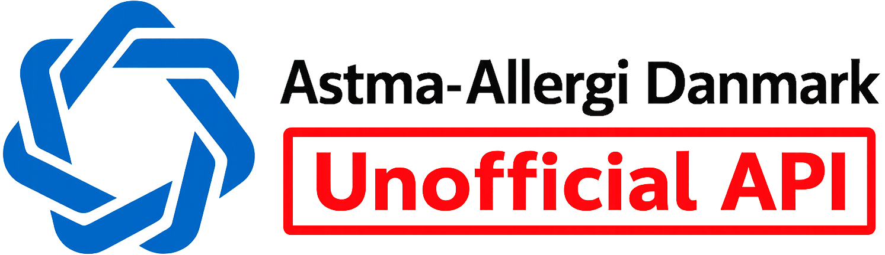
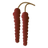
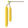
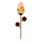
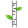
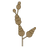
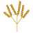

# 🇩🇰🤧 Pollen measurements from Astma-Allergi Denmark

<a href="https://github.com/rugaard/pollen/releases"></a>
<a href="https://creativecommons.org/licenses/by-nc-nd/4.0/"></a>

Astma-Allergi Denmark does unfortunately not offer an official API for the latest pollen measurements in Denmark.

This package is (in some form) a workaround for that. It fetches the latest measurements and short-term predictions directly from Astma-Allergi Denmark's data feed and turns it into structured, typed data objects.

The returned data shows the measured pollen between **13:00 (UTC +1)** _(1:00 PM)_ yesterday and **13:00 (UTC +1)** _(1:00 PM)_ present day. Every day at **16:30 (UTC +1)** _(4:30 PM)_, at the latest, the new measurements are being published.

## ⚠️ Disclaimer
Since Astma-Allergi Denmark is an independent union, with a very little government funding, this package is made available under a very strict license, which prohibits any use other than personal.

If you wish to use the pollen measurements commercially, you should contact Astma-Allergi Denmark directly and support them by buying the data instead. The payment goes directly to the maintenance and further development of their Pollen measurement service.

For more info about a commercial license, [visit their official website](https://hoefeber.astma-allergi.dk/pollenfeed).

## 📖 Table of contents

* [Requirements](#-requirements)
* [Installation](#-installation)
    * [Laravel](#laravel)
* [Usage](#-usage)
    * [Pollen Client](#pollen-client)
    * [Methods](#methods)
        * [Get measurements](#get-measurements)
    * [Return data structure](#return-data-structure)
* [Pollen stations](#-pollen-stations)
* [Allergens](#-allergens)
    * [Icons](#-icons)
* [Level classification](#-level-classification)
* [Frequently Asked Questions (FAQ)](#-frequently-asked-questions-faq)
    * [What is this `Illuminate\Support\Collection` class and how does it work?](#what-is-this-illuminatesupportcollection-class-and-how-does-it-work)
* [Donating to Astma-Allergi Denmark](#-donating-to-astma-allergi-denmark)
* [License](#-license)

## 🖥 Requirements

* **PHP 8.3** or higher
* **[GuzzleHTTP](https://github.com/guzzle/guzzle) 7.0** or higher

## 📦 Installation
You can install the package via [Composer](https://getcomposer.org/), by using the following command:
```shell
composer require rugaard/pollen
```

### Laravel
This package comes with an out-of-the-box Service Provider for the [Laravel](http://laravel.com) framework, which is loaded automatically via package discovery.

## ⚙️ Usage

First thing you need to do, is to instantiate the `Pollen` client:
```php
use Rugaard\Pollen\Pollen;

$pollen = new Pollen;
```

Once you've done that, you're ready to fetch the latest measurements.

### Pollen client

The Pollen client which handles the requests to Astma-Allergi Denmark.

```php
new Pollen(?GuzzleClientInterface $client = null);
```

| Parameter | Type | Default | Description |
| :--- | :--- | :---: | :--- |
| `$client` | `\GuzzleHttp\ClientInterface` | `null` | Replace the default underlying HTTP client |

### Methods

#### Get measurements

Get the latest pollen measurements and predictions. Optionally filter by station and/or exclude allergens that are currently out of season.

```php
get(?Station $station = null, bool $onlyInSeason = false): Collection
```

| Parameter | Type | Default | Description |
| :--- | :--- | :---: | :--- |
| `$station` | `Station\|null` | `null` | Filter by a specific [pollen station](#-pollen-stations). Returns all stations when `null`. |
| `$onlyInSeason` | `bool` | `false` | When `true`, allergens that are currently out of season are excluded from the result. |

_**Note**: The returned data shows the measured pollen between 13:00 (1:00 PM) yesterday and 13:00 (1:00 PM) present day. The measurements are updated everyday at 16:00 (4:00 PM)._

**Examples:**

```php
use Rugaard\Pollen\Enums\Station;
use Rugaard\Pollen\Pollen;

$pollen = new Pollen;

# All stations.
$measurements = $pollen->get();

# A specific station.
$measurements = $pollen->get(station: Station::East);

# A specific station, in-season allergens only.
$measurements = $pollen->get(station: Station::East, onlyInSeason: true);
```

### Return data structure

#### Single station

When a `$station` is provided, `get()` returns a `Collection` keyed by allergen code. Each value is either a `Collection` with measurement data, or `null` if the allergen is currently out of season.

```php
$measurements = $pollen->get(station: Station::East);

// Access a specific allergen.
$birch = $measurements->get('birch');

// $birch is a Collection:
// [
//     'date'        => '2024-04-01',        // measurement date
//     'value'       => 200,                 // raw grain count
//     'level'       => Level::High,         // classified level enum
//     'predictions' => Collection [         // null for spore allergens
//         ['date' => '2024-04-02', 'level' => Level::Moderate],
//         ['date' => '2024-04-03', 'level' => Level::Low],
//     ],
// ]

// Out-of-season allergens are null.
$mugwort = $measurements->get('mugwort'); // null
```

#### All stations

When no `$station` is provided, `get()` returns a `Collection` keyed by station value (`'east'`, `'west'`), where each entry contains the station's allergen measurements as described above.

```php
$measurements = $pollen->get();

$east = $measurements->get('east'); // Collection of allergens for Station::East
$west = $measurements->get('west'); // Collection of allergens for Station::West
```

## 🏛 Pollen stations

Currently there only exist two pollen stations in Denmark.

| Enum | ID | Name | Code | Region |
| :--- | :---: | :--- | :--- | :---: |
| `Station::East` | 48 | København | `east` | East |
| `Station::West` | 49 | Viborg | `west` | West |

## 🌿 Allergens

The following allergens are supported. Spore allergens do not have predictions.

| Enum | Code | Danish name | Type |
| :--- | :--- | :--- | :---: |
| `Allergen::Alder` | `alder` | El | Pollen |
| `Allergen::Hazel` | `hazel` | Hassel | Pollen |
| `Allergen::Elm` | `elm` | Elm | Pollen |
| `Allergen::Birch` | `birch` | Birk | Pollen |
| `Allergen::Grass` | `grass` | Græs | Pollen |
| `Allergen::Mugwort` | `mugwort` | Bynke | Pollen |
| `Allergen::Alternaria` | `alternaria` | Alternaria | Spore |
| `Allergen::Cladosporium` | `cladosporium` | Cladosporium | Spore |

### 🖼 Icons

The `assets/` folder contains a PNG icon for each allergen, named after its code.

| Icon | Allergen |
| :---: | :--- |
|  | `alder` |
|  | `hazel` |
|  | `elm` |
|  | `birch` |
|  | `grass` |
|  | `mugwort` |
|  | `alternaria` |
|  | `cladosporium` |

## 📊 Level classification

Each allergen measurement is classified into one of five levels, represented by the `Level` enum. Thresholds vary per allergen.

| Enum | Code | Danish name | Description |
| :--- | :--- | :--- | :--- |
| `Level::Unknown` | `unknown` | ukendt | No measurable pollen (count = 0) |
| `Level::Low` | `low` | lavt | Below the low threshold |
| `Level::Moderate` | `moderate` | moderat | Below the moderate threshold |
| `Level::High` | `high` | højt | Below the high threshold |
| `Level::VeryHigh` | `very-high` | meget højt | At or above the high threshold |

```php
use Rugaard\Pollen\Enums\Level;

$birch = $measurements->get('birch');

// Compare against a level.
if ($birch->get('level') === Level::VeryHigh) {
    // 🤧
}

// Get a machine-readable code.
$birch->get('level')->code(); // e.g. 'very-high'

// Get the Danish name.
$birch->get('level')->danishName(); // e.g. 'meget højt'
```

## 🗣 Frequently Asked Questions (FAQ)

#### What is this `Illuminate\Support\Collection` class and how does it work?

All data is returned within an `Illuminate\Support\Collection`. This is the same `Collection` class used by the [Laravel](https://laravel.com) framework, available as a standalone package — so no Laravel installation is required.

Please refer to [Laravel](https://laravel.com)'s detailed documentation to learn more about how you work with a `Collection`:<br>
[https://laravel.com/docs/collections](https://laravel.com/docs/collections)

## 💰 Donating to Astma-Allergi Denmark

To help Astma-Allergi Denmark maintain and further develop the Pollen measurement service.<br>
Please consider [sending them a donation](https://www.astma-allergi.dk/stot-os/giv-et-bidrag/).

## 🚓 License
This package is licensed under a [Creative Commons Attribution-NonCommercial-NoDerivatives 4.0 (CC BY-NC-ND 4.0)](https://creativecommons.org/licenses/by-nc-nd/4.0/).

<a rel="license" href="https://creativecommons.org/licenses/by-nc-nd/4.0/"></a>
